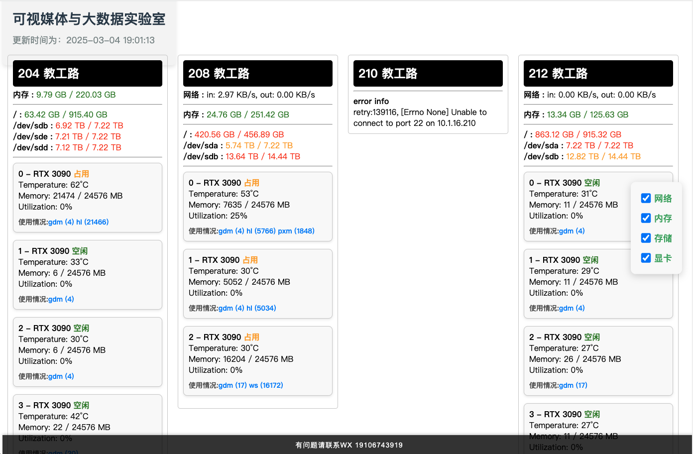

# 🌐 多服务器监控系统

本项目提供一个 **网页可视化界面**，用于 **同时监控多个服务器的状态**（包括 **网络、内存、硬盘、显卡等信息**）。

## 📌 主要原理
- **后端**（Python）：通过 SSH 连接服务器，定期获取数据并存储到字典中。
- **前端**（HTML + JS）：定期从后端获取数据并进行可视化展示。



---

## 🚀 2. 安装

### 2.1 运行环境
**后端程序** 需要以下环境，可使用 Conda 创建虚拟环境（适用于 Linux 和 Windows）：
```bash
pip install flask flask-cors paramiko -i https://pypi.tuna.tsinghua.edu.cn/simple
```

---

### 2.2 服务器环境
需要 **监控的服务器** 需要安装某些工具，以便正确获取数据：

- **`ifstat`** 📡 （用于获取网络数据）  
  - 通过 `apt` 安装：
    ```sh
    sudo apt install ifstat
    ```
  - **确认网卡名称**（如果需要查看网络数据）：
    ```sh
    ifstat
    ```
    **示例输出**（找出有数据变化的网卡，如 `eno2`）：  
    ```
        eno1                eno2          
    KB/s in  KB/s out   KB/s in  KB/s out   
        0.00      0.00      3.31      1.96  
    ```
    - 在 `serverList.json` 中配置 `network_interface_name`。

- **`gpustat`** 🎮 （用于获取显卡使用情况）
  - 通过 `apt` 安装：
    ```sh
    pip install gpustat
    ```

- **NVIDIA 驱动** 🚀 （如果使用 NVIDIA 显卡）
  - 需确保 `nvidia-smi` 可用：
    ```sh
    nvidia-smi
    ```
  - **AMD 显卡暂不支持**。

---

### 2.3 后端部署
1. **安装环境并配置服务器列表**
2. **运行后端**
   ```sh
   python app.py
   ```
3. **修改 `app.py` 相关参数**
   ```python
   app.run(debug=False, host="0.0.0.0", port=5000)
   ```
   - `debug=False` **生产环境建议关闭 debug**
   - `host="0.0.0.0"` **允许外部访问**
   - `port=5000` **按需修改**
   - 确保 **防火墙放行端口**

4. **配置文件 `serverList.json`**
   **格式示例：**
   ```json
   {
       "title": "10.1.16.216",
       "ip": "10.1.16.216",
       "port": 22,
       "username": "rzp",
       "password": "rzp",
       "key_filename": "/home/.ssh/id_rsa",
       "network_interface_name": "eno2",
       "storage_list": [
           "/media/D",
           "/media/F"
       ]
   }
   ```
   **参数说明**
   - `title`：服务器名称
   - `ip`：服务器地址
   - `port`：SSH 端口（默认 `22`）
   - `username`：SSH 登录用户名
   - `password` / `key_filename`：密码或密钥 **（二选一）**
   - `network_interface_name`：网卡名称 **（可选）**
   - `storage_list`：需要监控的磁盘路径 **（可选）**

🔄 **⚠️ `serverList.json` 变更后，需要重启 `app.py` 生效！**

---

### 2.4 网页部署
1. **使用 Docker + Nginx 部署**
   ```sh
   docker run -d -p 80:80 -v /home/lxb/nginx_gpus:/usr/share/nginx/html --name nginx_gpus nginx:latest
   ```
   **可修改**
   ```sh
   docker run -d \
     -p <本机端口>:80 \
     -v <网页目录>:/usr/share/nginx/html \
     --name <容器名称> \
     nginx:latest
   ```

2. **修改 `index.html`**
   - **更改 `fetchData()` 地址**
     ```javascript
     fetch('<后端地址>/all_data')
     ```
   - **修改数据刷新间隔**
     ```javascript
     setInterval(fetchData, 3000); // 每3秒刷新一次
     ```
     - 建议 **不要小于 `check_interval`**，否则浪费资源。

3. **访问网页**
   - 直接访问 **`http://服务器IP:80`**
   - 有域名可配置 **Nginx 反向代理** [👉 配置教程](http://blog.lxblxb.top/archives/1723257245091)

---

## 🎯 3. 其他
- **💡 `林雄彬`**：感谢学长的贡献
- **🔧 贡献 & 反馈**：欢迎提交 Issue / PR！

---

✅ **如果有问题，欢迎交流！😃** 🚀
